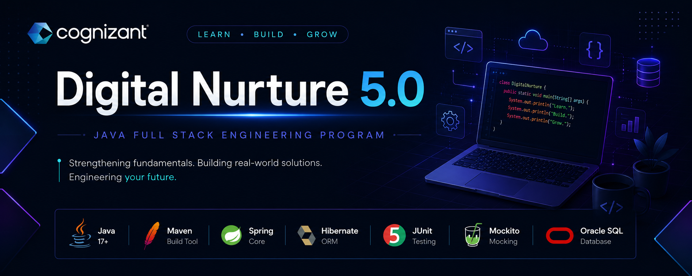

<div align="center">

# 🚀 Cognizant Digital Nurture 5.0

### Java FSE Repository



[](https://www.java.com/en/)
[](https://maven.apache.org/)
[](https://spring.io/)
[](https://hibernate.org/)
[](https://junit.org/)
[](https://site.mockito.org/)
[](https://www.oracle.com/database/)
</div>

---

# 📖 About

This repository contains all assignments, implementations, coding exercises, and mini-projects completed during the Cognizant Digital Nurture 5.0 Java Full Stack Engineering Program.

---

# 📑 Table of Contents

- 📚 Curriculum
- 📂 Folder Structure
- 🚀 Technologies
- 📅 Weekly Progress
- 📸 Screenshots
- 🛠️ Setup

---

# 📚 Curriculum

| Week | Module / Topic | Key Concepts Covered |
|------|----------------|----------------------|
| **Week 1** | Data Structures & Algorithms | Binary Search, Linear Search, Recursion, Time & Space Complexity |
| | Design Patterns | Factory, Builder, Singleton, Adapter, Strategy |
| | Unit Testing | JUnit 5 Assertions, Test Lifecycle, Edge Case Testing |
| | Mocking | Mockito, Stubbing, Verification |
| | Logging | SLF4J, Logging Levels (Trace, Debug, Info, Warn, Error) |
| | Oracle PL/SQL | Cursors, Triggers, Packages, Stored Procedures, Exception Handling |
| **Week 2** | Spring Core (Maven) | Spring Framework, Maven, IoC Container, Bean Configuration, XML Configuration, Dependency Injection, Spring AOP, Constructor & Setter Injection, Component Scanning |
| | Spring Data JPA & Hibernate | JPA, Hibernate ORM, Spring Data JPA, Entity Mapping, Repositories, CRUD Operations, Spring Boot Integration |
| **Week 3** | Spring REST APIs | REST Architecture, REST Controllers, CRUD APIs, Request Mapping, ResponseEntity, Path Variables, Request Parameters |
| | Spring Web | Spring MVC, DispatcherServlet, Controller Layer, View Resolution, Dependency Management |
| | JWT Authentication | JSON Web Tokens (JWT), Authentication, Authorization, Token Generation & Validation, Spring Security Basics |
---

# 📂 Folder Structure

```text
DigitalNurture
│
├── WEEK-1
│
├── WEEK-2
│
├── WEEK-3
│
├── WEEK-4
│
├── WEEK-5
│
└── README.md
```

---

# 🚀 Technologies

- Java 17
- Maven
- Spring Core
- Spring Boot
- Hibernate
- Oracle SQL
- JUnit
- Mockito
- Git & GitHub

---

# 📅 Weekly Progress

| Week | Status |
|------|--------|
| Week 1 | ✅ Completed |
| Week 2 | ✅ Completed |
| Week 3 | ✅ Completed |
| Week 4 | ⏳ Pending |

---

Open the desired week's project.

Compile using Maven.

```bash
mvn clean install
```

---

# ⭐ Support

If you found this repository useful, consider giving it a ⭐.
